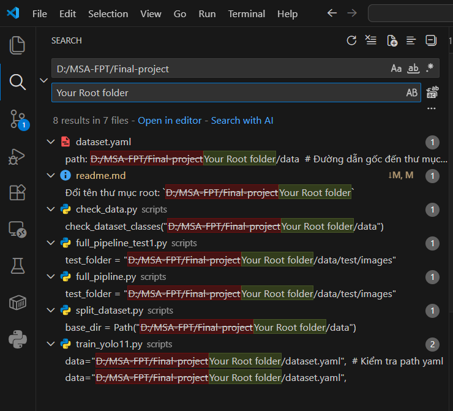

# 🚗 License Plate Recognition System (YOLO11 + EasyOCR)

Dự án nhận diện và trích xuất thông tin biển số xe tự động sử dụng mô hình **YOLO11** (Ultralytics) để phát hiện vị trí biển số và **EasyOCR** để đọc ký tự.

  

## 📋 Tính năng chính
* **Detection:** Phát hiện chính xác vị trí biển số xe trong ảnh (xe máy, ô tô).
* **Cropping:** Tự động cắt vùng biển số và xử lý ảnh để tăng độ nét.
* **OCR:** Đọc ký tự từ biển số đã cắt.
* **Pipeline:** Quy trình tự động hóa hoàn toàn từ đầu vào (ảnh thô) đến đầu ra (ảnh kết quả + text biển số).
* **Auto-Update Model:** Tự động cập nhật trọng số tốt nhất (`best.pt`) sau mỗi lần train để Pipeline sử dụng ngay lập tức.

## 📂 Cấu trúc thư mục

```text
Final-project/
├── data/                   # Chứa dữ liệu train/val (Không push lên Git nếu quá nặng)
│   ├── images/             # Ảnh gốc (train/val)
│   └── labels/             # Nhãn YOLO (train/val)
├── scripts/                # Các script phụ trợ
│   ├── check_data.py       # Kiểm tra lỗi dataset
│   ├── full_pipeline.py    # Chạy nhận diện toàn bộ
│   └── ...
├── runs/                   # Chứa kết quả training (log, weights)
├── results_final/          # Kết quả output cuối cùng (Ảnh đã vẽ box + text)
├── crop_images/            # Ảnh biển số được cắt riêng
├── test_images/            # Ảnh dùng để test nhanh
├── dataset.yaml            # Cấu hình đường dẫn dữ liệu
├── train_yolo11.py         # Script huấn luyện mô hình
├── requirements.txt        # Các thư viện cần thiết
└── README.md               # Hướng dẫn sử dụng
```

# 📖 Hướng Dẫn Cài Đặt và Chạy Dự Án Nhận Diện Biển Số

Tài liệu này hướng dẫn chi tiết cách thiết lập môi trường và chạy các script quan trọng trong dự án YOLO11 License Plate Recognition.

## 🛠️ 1. Yêu Cầu Hệ Thống
* **Hệ điều hành:** Windows 10/11
* **Python:** Phiên bản 3.12 (Bắt buộc)
* **CUDA (Tùy chọn):** Cần thiết nếu muốn train bằng GPU (yêu cầu card NVIDIA). Nếu không có, dự án sẽ tự chạy bằng CPU.

## ⚙️ 2. Thiết Lập Môi Trường (Lần đầu tiên)

**Bước 1: Mở Terminal tại thư mục gốc dự án**

Đổi tên thư mục root: `D:/MSA-FPT/Final-project`

**Bước 2: Tạo môi trường ảo (Virtual Environment)**
Để cách ly thư viện dự án với hệ thống, hãy chạy lệnh sau:
```bash
# Tạo môi trường ảo
python -m venv .venv_yolo11

# Kích hoạt môi trường ảo
# Windows:
.\venv\Scripts\activate
# MacOS/Linux:
source venv/bin/activate

# Cài đặt thư viện từ file requirements.txt
pip install -r requirements.txt
```
**Bước 2: Train YOLO**
```bash
python scripts/check_data.py
python train_yolo11.py
```
**Bước 3: Run OCR test Result**
```bash
python full_pipline.py
```


